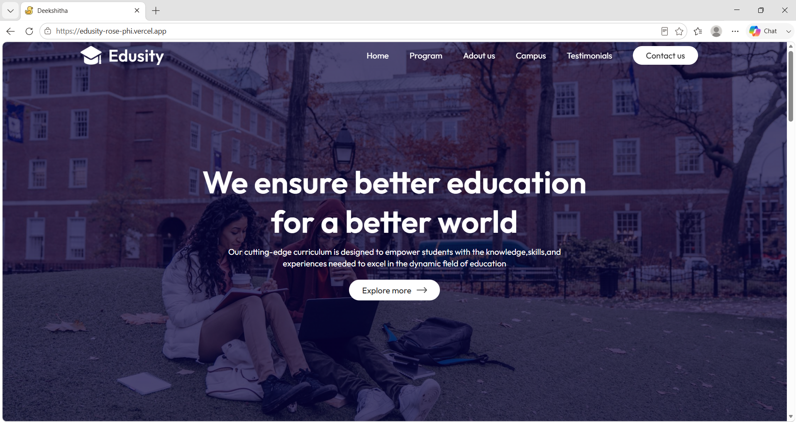

# 🎓 Edusity

Edusity is a modern and responsive educational website built using React and Vite. The platform provides an engaging user experience for students by showcasing courses, campus facilities, student testimonials, and academic opportunities through a clean and intuitive interface.

## 🌐 Live Demo

https://edusity-rose-phi.vercel.app

---

## 📖 About

Edusity is designed to offer students and visitors an overview of educational opportunities and campus life. The website features a responsive design, interactive sections, and a modern user interface to enhance user engagement.

---

## 📸 Screenshot



---

## ✨ Features

- Responsive design for all devices
- Modern and user-friendly interface
- Course information section
- Campus gallery
- Student testimonials
- Contact section
- Smooth navigation experience
- Fast performance with Vite

---

## 🛠️ Technologies Used

- React.js
- Vite
- JavaScript (ES6+)
- HTML5
- CSS3

---

## 🚀 Getting Started

### Clone the Repository

```bash
git clone https://github.com/DeekshithaS1/edusity.git
```

### Navigate to the Project Directory

```bash
cd edusity
```

### Install Dependencies

```bash
npm install
```

### Run the Development Server

```bash
npm run dev
```

The application will be available at:

```bash
http://localhost:5173
```

---

## 📂 Project Structure

```text
edusity/
├── public/
├── src/
│   ├── assets/
│   ├── Components/
│   ├── App.jsx
│   └── main.jsx
├── index.html
├── package.json
├── vite.config.js
├── screenshot.png
└── README.md
```

---

## 🔗 GitHub Repository

GitHub: https://github.com/DeekshithaS1/edusity

---

## 👩‍💻 Author

**Deekshitha S**

GitHub: https://github.com/DeekshithaS1

---

## 📄 License

This project is developed for educational and learning purposes.
